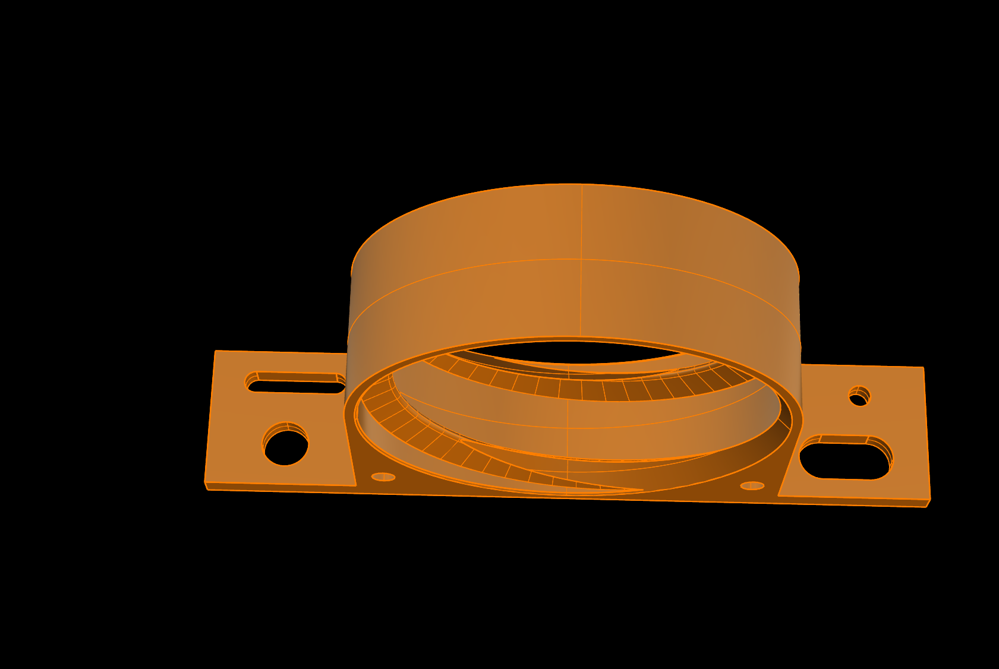

# Flexible airhose holder for ComMarker Omni 1
Holder for flexible 80 mm airhose for the fume extractor, mountable on ComMaker Omni 1 base plate or honeycomb. Created with Rhino 8.

You can mount it using 2 M10 bolts on a honaycomb bed or directly on the Omni 1 base plate using 2 M4 bolt.
One of each hole (M10 or M4) is a slotted hole so you can mount it in a angled position.

Additionally i uploaded a second holder to mount the airhose from xTool fume extractor. I use a 300 mm lens on my Omni 1. To use this lens, ComMarker send me a riser for the tower. This holder can be mounted to the riser element. 

Requirements:

    3D printer
    Filament of your choice (i use PETG)
    2 M10 bolts for honaycomb bed or
    2 M4 bolts for base Omni 1 base plate
    

## View

 
 

 
 
 

 
 

